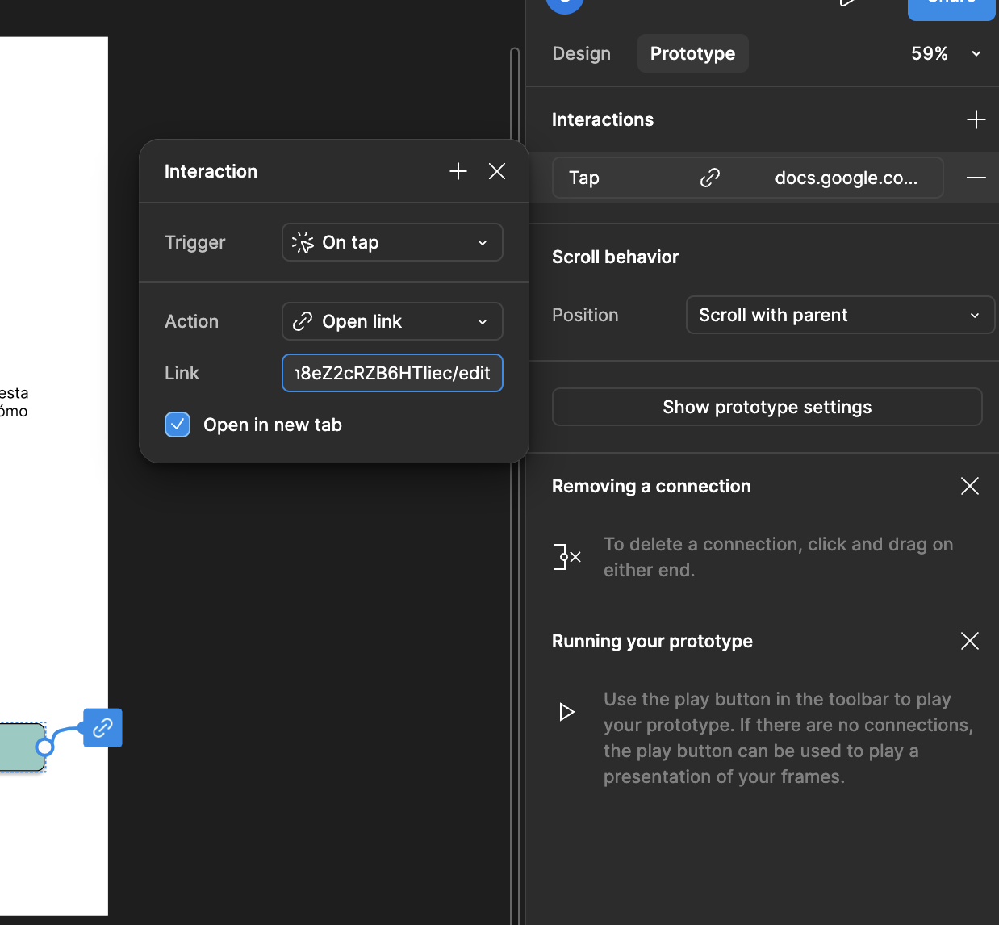
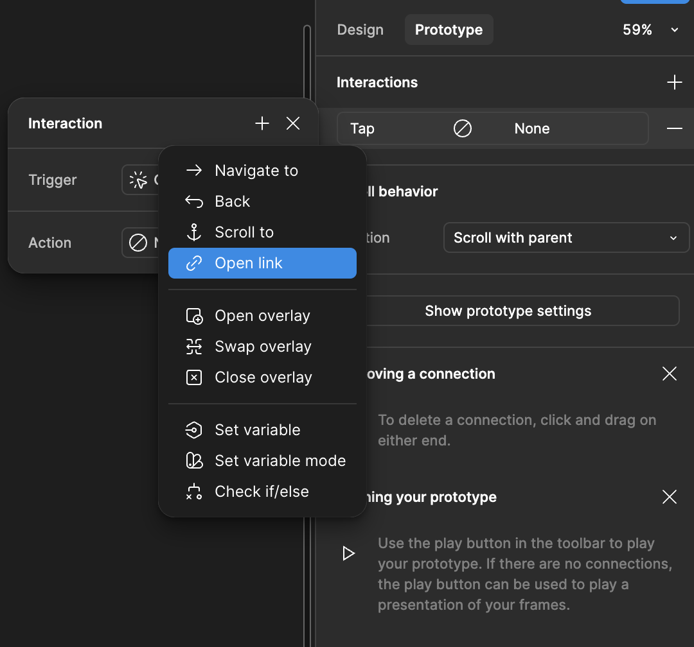

# Usability test

Ve a google forms: https://docs.google.com/forms/u/0/

Crea las siguientes preguntas o adapatalas segun tus necesidades. 

Primera impresión:
¿Qué te pareció la app en general? (Respuesta abierta)
¿Entendiste de qué se trata la app y para qué sirve? (Sí/No)
Si no, ¿qué crees que podría mejorarse para que sea más claro?

¿Habias usado alguna app similar? (Sí/No)
Si no, ¿qué te gustaria que tuviera o que falto en esta que usaste?

Facilidad de uso:
¿Qué tan fácil te resultó completar las tareas? (Escala del 1 al 5)
¿Hubo algo que no pudiste completar? Si es así, ¿por qué? (Respuesta abierta)

Utilidad:
¿Crees que esta app sería útil en un entorno escolar? (Sí/No)
Si no, ¿qué le falta para serlo?
¿Qué funcionalidad te pareció más relevante o importante? (Respuesta abierta)

Opinión general y mejoras:
¿Qué cambiarías o agregarías para mejorar la app? (Respuesta abierta)
Si tuvieras que recomendar esta app a alguien, ¿a quién sería? (Respuesta abierta)

Mantenlo facil. El test debe durar para este caso 5-10 mins como maximo.

## Anadir la encuesta:

En figma crea un frame adicional al final para que se vea cuando termine la interaccion del usuario, crea un mensaje que contenga algo similar a:
Gracias por tu atencion, por favor ayudame a contestar esta pequena encuesta para saber como mejorar, y un boton con el enlace a tu formulario.
Para hacer el boton con el enlace en figma: 

1. Usa el cuadro de text para anadir el mensaje para que el usuario responda tu encuesta.
2. Usa un rectangulo para crear el boton, anadele un texto: Responder encuesta
3. Pasa a la ventana prototype(prototipo) y en el boton cuando aparezca el conector azul, seleccinalo y ponle Open Link
4. Anade tu enlace.

Checa las imagnes si aun tienes duda.

Analiza los resultados obtenidos.
